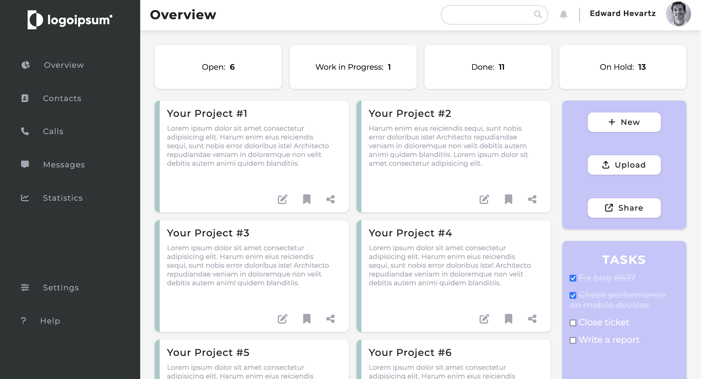

# Admin Dashboard

<h3 align="center"><a href="https://praesidi.github.io/admin-dashboard/">DEMO</a></h2>

## About the project
This project was made as a part of The Odin Project curriculum. The main goal was to learn Grid and use the acquired knowledge to build good-looking admin dashboard page. The project isn't fully responsive, but I will fix it in the near future.

## Resources
* Icons: [fontawesome.com](fontawesome.com)
* Logo: [logoipsum.com](logoipsum.com)
* Favicon: [flaticon.com](flaticon.com)
* User image: [minimaltoolkit.com](minimaltoolkit.com)

## Built with
* HTML
* CSS

## Future Updates
* Make the page mobile responsive